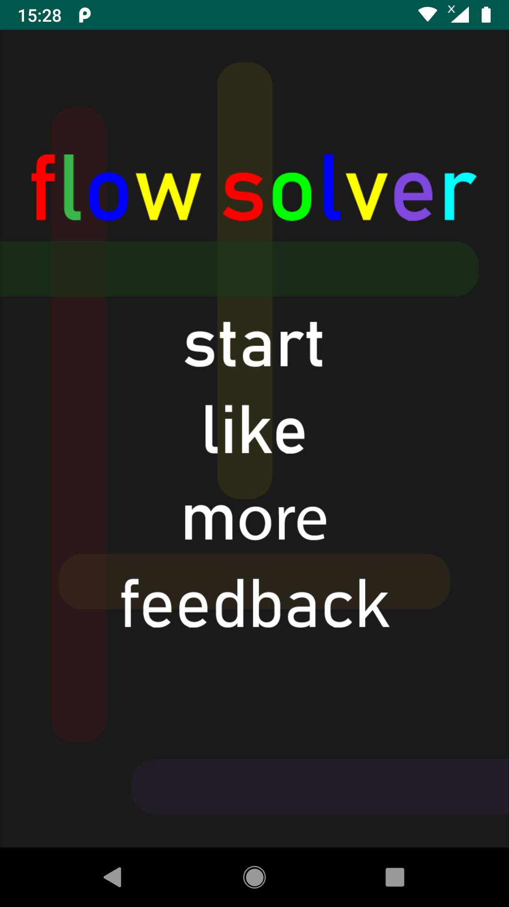
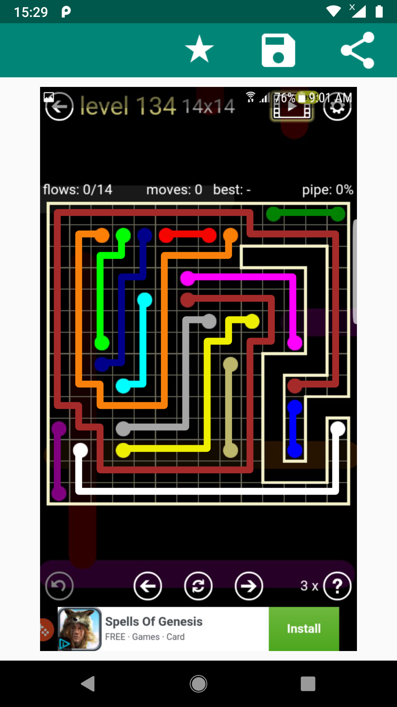
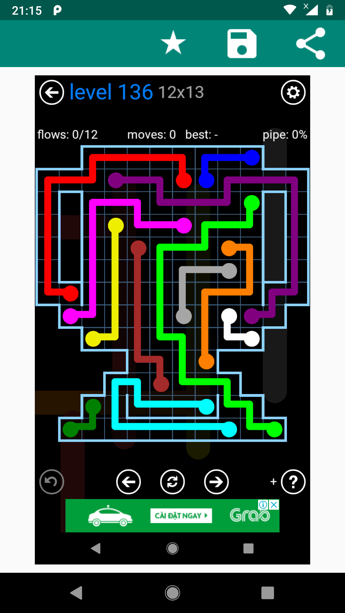

## FlowTree Game Solver

The FlowTree Game Solver is a mobile application that automatically solves puzzles in the FlowTree game. By analyzing screenshots of the game board,
the solver detects dots of different colors and finds the optimal solution to connect them. It provides a convenient way to find solutions and complete
challenging puzzles in the FlowTree game.

Please note that the FlowTree Game Solver relies on accurate screenshots and good image quality for optimal performance. Make sure to capture clear screenshots of 
the game board to ensure accurate detection and solution.

## Algorithm

The FlowTree Game Solver utilizes image processing techniques to detect the dots of different colors in the puzzle screenshot. Once the dots are identified,
the solver employs a SAT (Boolean satisfiability problem) solver algorithm to find the optimal solution for connecting the dots.
The SAT solver algorithm formulates the problem as a logical proposition, where the variables represent the connections between the dots. It then systematically 
explores different combinations of connections to satisfy the puzzle constraints, ensuring that each dot is connected to exactly one other dot of the same color 
without any crossings.
By leveraging the power of SAT solvers, the FlowTree Game Solver can efficiently handle complex puzzles and provide fast and accurate solutions.

## Screenshots
Include some screenshots of your FlowTree Game Solver app to give users a visual preview. You can add them to a separate folder in your project repository and reference them in your README file like this:

## Demo

Check out this [demo video](https://www.youtube.com/shorts/p5-xAFQuIU0) that showcases the FlowTree Game Solver in action. It provides a visual demonstration of how the solver analyzes the game board screenshot, detects the dots of different colors, and finds the optimal solution to connect them.

